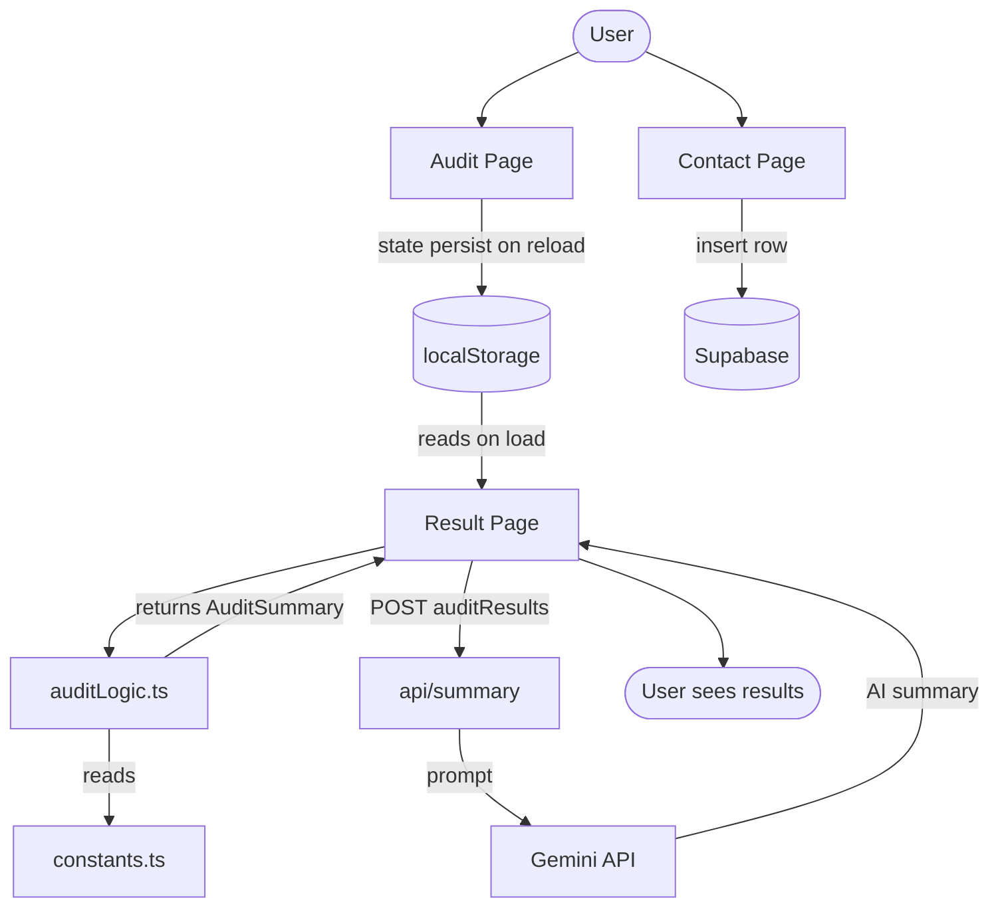

# Architecture

## System Diagram

---

## Data Flow

How a user's input becomes an audit result — in plain terms.

1. **User fills the form** — tool name, plan, seats. Saved to `localStorage` on every keystroke, so state persist on reload.
2. **User hits "Generate Audit"** — the result page loads and reads the saved tools from `localStorage`.
3. **`auditLogic.ts` runs** — loops through each tool, compares the selected plan against `AUDIT_TOOL_CONFIG` metadata (seat ranges, use case fit, pricing), and produces a recommendation per tool.
4. **Results render** — hero savings figure, per-tool audit cards, severity badges. Sorted by highest savings first.
5. **AI Summary fires** — the result page POSTs the structured audit results to `/api/summary`, which forwards them to the Gemini API and returns a short executive summary.
6. **Contact form** — separately, if the user submits the emailID and other details, that row lands directly in Supabase.

---

## Why This Stack

| Choice | Reason |
|---|---|
| **Next.js** | File-based routing made spinning up pages fast |
| **TailwindCSS** | Easier and faster to apply on components |
| **TypeScipt** | For better type safty |
| **localStorage** | To persist the state on reloads |
| **Gemini API** | Gemini produces better structured financial response |
| **Supabase** | Free tier, instant REST API, no backend boilerplate for a simple leads table |

Nothing here is over-engineered for what is essentially a client-side audit tool.

---

## Scaling to 10k Audits/Day

The audit runs entirely in the browser today, so compute already scales — there's no server doing the audit's work. But a few things would break under real load.

**Rate-limit the AI summary endpoint**
`/api/summary` calls Gemini on every page load with no throttle. At scale that gets expensive fast. Fix: cache the summary keyed by a hash of the audit inputs, or add a Redis-backed rate limiter.

**Queue heavy work**
If the audit logic ever gets more complex, move it to a background job queue instead of running synchronously in the browser.

**Analytics on the leads table**
The Supabase `leads` table works fine for hundreds of rows. At 10k+ audits/day you'd want a dashboard on top — Metabase, or a simple admin page querying Supabase directly.

Everything else — the audit logic, the pricing config, the UI — scales fine as-is.
